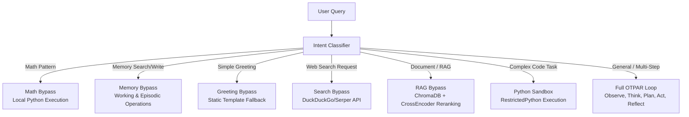
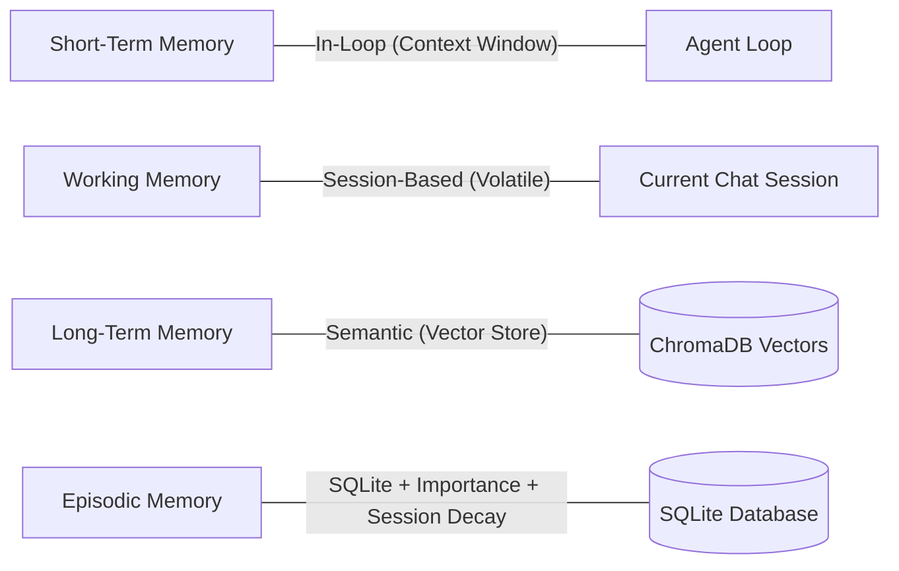

# 🌌 ASTRA-OS

> **Local-First AI Operating Runtime.** Offline by design. No cloud. No telemetry. Complete control over your data.

---

<p align="center">
  
  
  
  
</p>

---

## 💡 What is ASTRA-OS?

ASTRA-OS is a local AI runtime — not a chatbot wrapper. It runs a full autonomous **OTPAR agentic loop**, manages a **4-tier memory architecture**, indexes your filesystem in real-time with an active watcher, and schedules background autonomous agents. It does all of this completely offline, on your own local hardware.

---

## 🏗️ System Architecture

ASTRA-OS is built on a high-throughput bypass routing architecture. For maximum efficiency, simple queries bypass the agent loop entirely.

### 1. Request Flow & Intent Bypass Routing (7-Tier)



### 2. 4-Type Memory System



- **Short-Term Memory (STM)**: Inside the active prompt context, optimized for immediate task flow.
- **Working Memory**: Fast session-based memory for temporary variables and conversational state.
- **Long-Term Memory**: Semantic document embeddings stored in ChromaDB for domain-specific knowledge.
- **Episodic Memory**: Relational SQLite records storing past interactions with importance scores, decay rates, and cross-session retrieval.

---

## 🛠️ Technology Stack

| Layer | Component | Description |
| :--- | :--- | :--- |
| **Backend** | `FastAPI`, `SQLModel` | High-performance async endpoints and ORM layer. |
| **Database** | `SQLite (WAL mode)`, `ChromaDB` | Persistent state storage and local vector store. |
| **AI Runtime** | `Ollama` | Local LLM engine executing `qwen2.5:3b` and `nomic-embed-text`. |
| **Agent Loop** | `OTPAR` | Observe, Think, Plan, Act, Reflect cycle. |
| **Sandbox** | `RestrictedPython` | AST validation, memory bomb protection, and 8-second timeout. |
| **Frontend** | `Next.js`, `TypeScript`, `Tailwind` | Ultra-responsive, premium interface with `Framer Motion` micro-animations. |
| **Automations** | `watchdog`, `APScheduler` | Debounced file watch auto-indexer + cron scheduling engine. |

---

## ✨ Features

- 💬 **Main Chat** — Multi-intent chat interface featuring Server-Sent Events (SSE) stream rendering and instant WebLLM offline fallback.
- 🤖 **Autonomous Agent** — Dedicated execution dashboard displaying real-time OTPAR telemetry, active thought logs, and step tracking.
- 📁 **Document Manager** — Drag-and-drop document upload with heading-aware chunking, vector ingestion streams, and metadata controls.
- 🧠 **Memory Browser** — Visual interface to browse, filter, edit, or purge episodic memory records and control importance scores.
- ⚙️ **System Settings** — Control active personas, custom system rules, tool execution permissions, folder watcher paths, and Sleep Mode.
- 💤 **Sleep Mode** — Automatically unloads the model from RAM when idle; auto-wakes seamlessly on the next incoming query.
- ⏰ **Scheduled Agents** — Establish cron-based background jobs running in isolated runtime sessions with auto-recovery.
- 🛡️ **Human-in-the-Loop** — Explicit permission gates prompting approval for risky actions (e.g. file writing, sending emails, web submission).

---

## 🔒 Security Hardening

ASTRA-OS is engineered for complete privacy and isolation:
1. **Bearer Token Authentication**: All `/api/v1/` routes require local token-based verification.
2. **CORS Restrictions**: Strict localhost origin locking preventing cross-site scripting hijacks.
3. **Execution Sandbox**: Runs arbitrary code inside a restricted AST environment using `RestrictedPython`.
4. **Data Redaction**: Dynamic 3-layer PII filter protecting sensitive data before entering episodic memory.
5. **No Telemetry**: Absolutely no external analytics, cloud sync, or background data exfiltration.

---

## 🔬 Verification & Certification

ASTRA-OS undergoes rigorous platform-level verification to guarantee reliability:

```
======================================================================
  ASTRA-OS Foundation Certification Suite — 100% Passed
  113 Tests | 113 Passed | 0 Failed
======================================================================
```

### Certified Coverage Areas
* **Security & Auth**: Route auth enforcement, RestrictedPython AST isolation, and token lifecycle management.
* **Layout & UI**: Flexible grid resizing, AnimatePresence transition safety, and custom element IDs.
* **Ollama Reliability**: Cold-start warmups, model loading, and HTTP connection timeout protection.
* **Scheduler & Watcher**: Async cron job execution, watchdog folder debounce, and SHA-256 duplicate filters.
* **Observability**: Consistent audit schemas (`created_at` consistency) and endpoint approval logging.
* **E2E Stability**: Playwright browser flows, 30-minute session stability, and SQLite WAL persistence.

For comprehensive details, refer to the [docs/audits/](./docs/audits/) folder.

---

## 🚀 Local Setup

### Prerequisites
- Python 3.11+
- Node.js 18+
- [Ollama](https://ollama.ai) installed and running locally with:
  ```bash
  ollama pull qwen2.5:3b
  ollama pull nomic-embed-text
  ```

### Installation

1. **Clone the Repository**
   ```bash
   git clone https://github.com/Chandradeep05/astra-os.git
   cd astra-os
   ```

2. **Backend Setup**
   ```bash
   cd backend
   python -m venv .venv
   source .venv/bin/activate  # On Windows: .venv\Scripts\activate
   pip install -r requirements.txt
   uvicorn main:app --reload --port 8000
   ```

3. **Frontend Setup**
   ```bash
   # Open a new terminal
   cd frontend
   npm install
   npm run dev
   ```

4. **Access the Runtime**
   Open http://localhost:3000 in your browser.

---

## 🗺️ Roadmap

- [ ] **Phase 3C** — Email (IMAP/SMTP) + Calendar read/write integrations.
- [ ] **Phase 3C** — Multi-model routing (3B classification → 7B synthesis).
- [ ] **Phase 4** — Tauri desktop packaging + Ollama auto-installer.
- [ ] **Phase 4** — Global hotkey controls + system tray runtimes.
- [ ] **Phase 4** — Plugin system to expose the unified `ToolRegistry`.

---

## ⚠️ Known Limitations

- **Ollama Startup Latency**: First-time model loads (cold starts) can take 20-60s depending on host RAM.
- **Hardware Profile**: Minimum recommended RAM is 8GB (16GB recommended for multi-model routing).
- **OS Support**: Windows is the primary development target; Linux is supported; macOS is currently untested.

---

## 📄 License

Distributed under the MIT License. See `LICENSE` for details.
